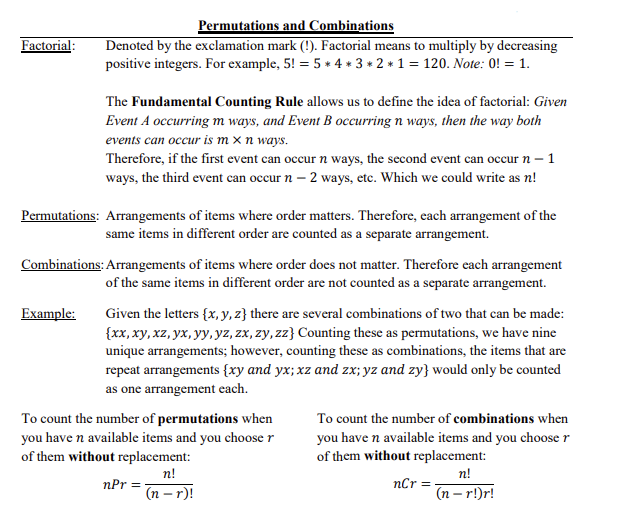

# Permutations and Combinations (Fixed length)

The following image describe the formula to get the number of permutations or combinations
* n = number of elements in the input list
* r = the decided length of the permutations or combinations

